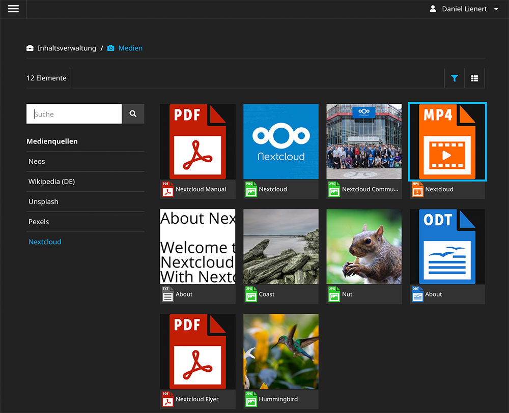

# Nextcloud Asset Source for Neos

This package provides a direct access from the Neos media module to assets stored in your [Nextcloud](https://nextcloud.com/).

## Installation
Install the package via composer 

`composer require dl/assetsource-netxtcloud`

## Configuration
I recommend to add a new user to your Nextcloud to be used only by this asset source and share everything that should be accessible from within Neos with this user.

1. Configure the server and user credentials.
2. Enable the preview generation capabilities according to your Nextcloud settings.

## Limitations

The Nextcloud / WebDav API has some limitations which needed some workaround to make it suitable as Neos asset source.

- No possibility to get the amount of files available / the files included in a search result. Therefore a maximum of  files to retrieve needs to be set in settings, which defaults to 200:

	`assetResultLimit: 200`

### Development Resources

* Webdav Search: [https://docs.nextcloud.com/server/15/developer_manual/client_apis/WebDAV/search.html]()
* OCS Api: https://docs.nextcloud.com/server/15/developer_manual/client_apis/OCS/index.html
* Nextcloud Gallery API: https://github.com/nextcloud/gallery/wiki/RESTful-API
